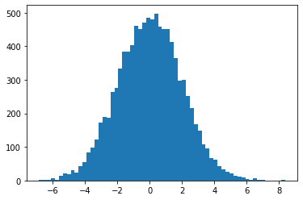
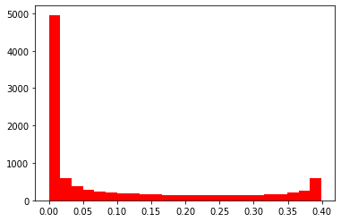

# Skewness and Kurtosis - Lab

## Introduction

In this lab, you'll calculate skewness and kurtosis for a given dataset in SciPy using Python.

## Objectives
You will be able to:

* Calculate and interpret values of skewness and kurtosis

## Bring in SciPy
In the previous lesson, you have seen formulas to calculate skewness and kurtosis for your data. SciPy comes packaged with these functions and provides an easy way to calculate these two quantities, see [scipy.stats.kurtosis](https://docs.scipy.org/doc/scipy/reference/generated/scipy.stats.kurtosis.html#scipy.stats.kurtosis) and [scipy.stats.skew](https://docs.scipy.org/doc/scipy/reference/generated/scipy.stats.skew.html). Check out the official SciPy documentation to dig deeper into this. Otherwise, simply pull up the documentation within the Jupyter notebook using `shift+tab` within the function call or pull up the full documentation with `kurtosis?` or `skew?`, once you have imported these methods from the SciPy package.

You'll generate two datasets and measure/visualize and compare their skew and kurtosis in this lab.


```python
# Import required libraries
import numpy as np
import matplotlib.pyplot as plt

from scipy.stats import kurtosis, skew
```

## Take 1
* Generate a random normal variable `x_random` in NumPy with 10,000 values. Set the mean value to 0 and the standard deviation to 2.
* Plot a histogram of the data, set bins to `auto` (default). 
* Calculate the skewness and kurtosis for this data distribution using the SciPy functions.
* Record your observations about the calculated values and the shape of the data. 


```python
# generate random normal variable with 10,000 values, mean = 0 and SD=2
x_random = np.random.normal(loc=0, scale=2, size=10000)

# plot histogram set bins to auto
plt.hist(x_random, bins='auto')

# calc skewness and kurtosis with scipy
s = skew(x_random)
k = kurtosis(x_random)
print ('Skewness =', s)
print ('kurtosis =', k)

# Skewness = -0.0025781248189666343
# kurtosis = 0.03976806960642154

```

    Skewness = 0.01747293159078567
    kurtosis = 0.022109742529356602





### Your observations here 


* Data is normally distributed and symmetrical 

* A very slight positive skewness is observed as there are slightly more values on the left side of distribution mean than those on left side


* The kurtosis value shows that this distribution is Platykurtic ( kurtosis<3 ):
    When a distribution is platykurtic, the distribution is shorter and tails are thinner than the normal distribution. The peak is lower and broader than Mesokurtic, which means that the tails are light and that there are fewer outliers than in a normal distribution.

## Take 2

Let's generate another distribution 


```python
x = np.linspace( -5, 5, 10000 )
y = 1./(np.sqrt(2.*np.pi)) * np.exp( -.5*(x)**2  )  # normal distribution
```

* Plot a histogram for data $y$, and set bins to auto (default).
* Calculate the skewness and kurtosis for this data distribution using the SciPy functions.
* Record your observations about the calculated values and the shape of the data.


```python
# plot histogram for y, set bins to auto
plt.hist(y, bins='auto', color='r')

# calc skewness and kurtosis with scipy
s = skew(y)
k = kurtosis(y)
print ('Skewness =', s)
print ('kurtosis =', k)

# Skewness = 1.109511549276228
# kurtosis = -0.31039027765889804
```

    Skewness = 1.109511549276228
    kurtosis = -0.31039027765889804





#### Your observations here 
* high positive skewness : more values on left side of distribution mean than those on the right

* platykurtic: negative kurtosis value indicates thinner tails and flatter peak than the normal distribution.

* distribution is obviously not normal.


## Summary

In this lesson we learned how to calculate, visualize, and analyze the skewness and kurtosis for any given distribution. We worked with synthetic datasets at this stage to get the concepts cleared up. Later we will try these techniques on real datasets to see if they are fit for analysis (or not). 
